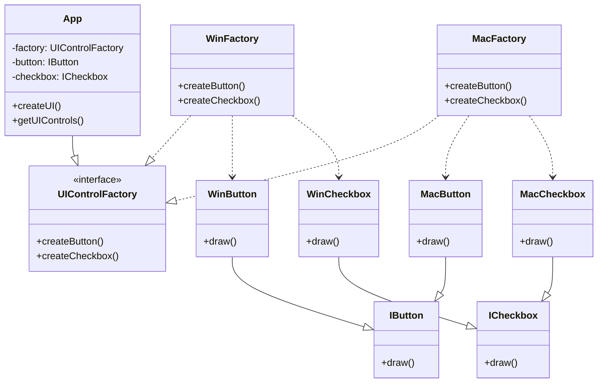

```mermaid
classDiagram
    WinFactory ..|> UIControlFactory
    MacFactory ..|> UIControlFactory
    WinButton --|> IButton
    MacButton --|> IButton
    WinCheckbox --|> ICheckbox
    MacCheckbox --|> ICheckbox
    MacFactory ..> MacButton
    MacFactory ..> MacCheckbox
    WinFactory ..> WinButton
    WinFactory ..> WinCheckbox
    App --|> UIControlFactory

    class UIControlFactory{
        <<interface>>
        +createButton()
        +createCheckbox()
    }

    class WinFactory{
        +createButton()
        +createCheckbox()
    }

    class MacFactory{
        +createButton()
        +createCheckbox()
    }

    class IButton{
        +draw()
    }

    class WinButton{
        +draw()
    }

    class MacButton{
        +draw()
    }

    class ICheckbox{
        +draw()
    }

    class WinCheckbox{
        +draw()
    }

    class MacCheckbox{
        +draw()
    }

    class App{
        -factory: UIControlFactory
        -button: IButton
        -checkbox: ICheckbox
        +createUI()
        +getUIControls()
    }
```
