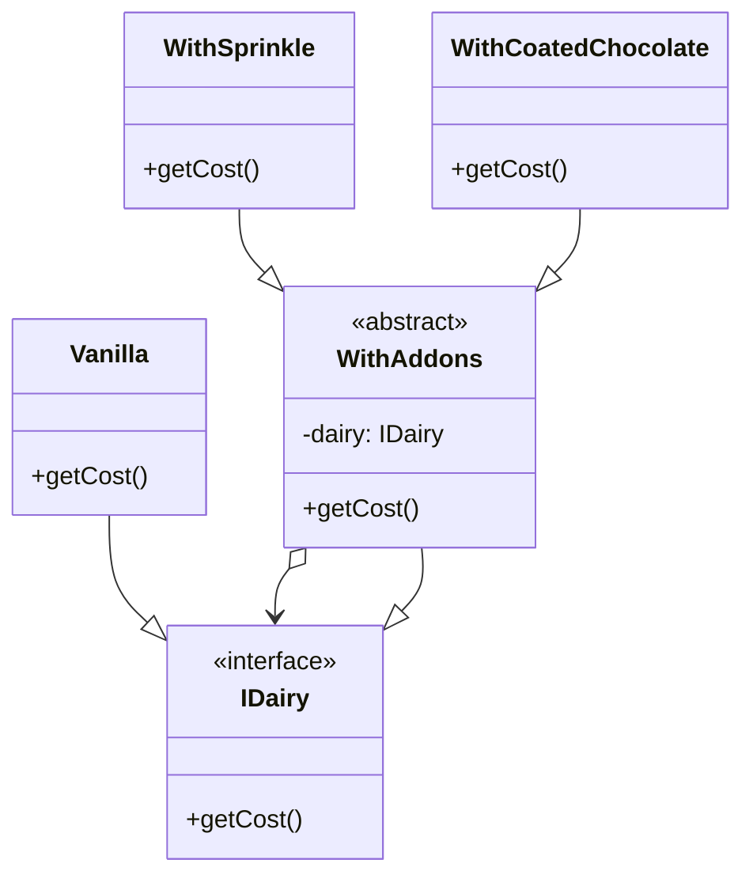

```mermaid
classDiagram
    Vanilla --|> IDairy
    WithAddons o--> IDairy
    WithAddons --|> IDairy
    WithSprinkle --|> WithAddons
    WithCoatedChocolate --|> WithAddons
    class Vanilla {
        +getCost()
    }
    class IDairy{
        <<interface>>
        +getCost()
    }
    class WithAddons{
        <<abstract>>
        -dairy: IDairy
        +getCost()
    }
    class WithSprinkle{
        +getCost()
    }
    class WithCoatedChocolate{
        +getCost()
    }
```
