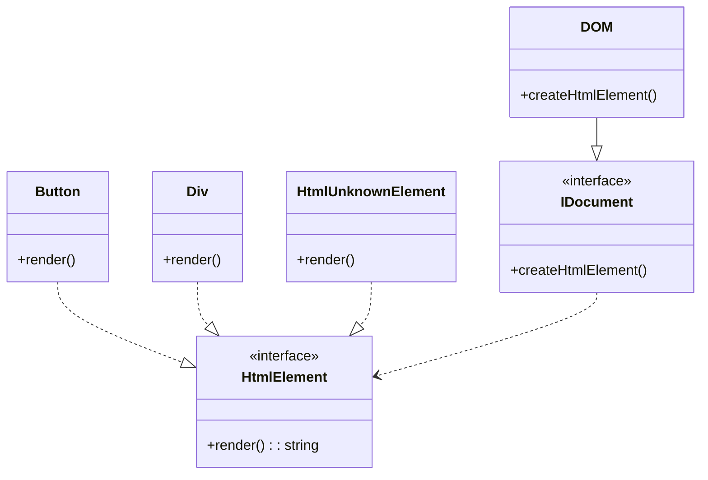

```mermaid
classDiagram
    Button ..|> HtmlElement
    Div ..|> HtmlElement
    HtmlUnknownElement ..|> HtmlElement
    DOM --|> IDocument
    IDocument ..> HtmlElement

    class IDocument{
        <<interface>>
        +createHtmlElement()
    }

    class DOM{
        +createHtmlElement()
    }

    class Button{
        +render()
    }
    class Div{
        +render()
    }
    class HtmlUnknownElement{
        +render()
    }
    class HtmlElement {
        <<interface>>
        +render(): string
    }
```
