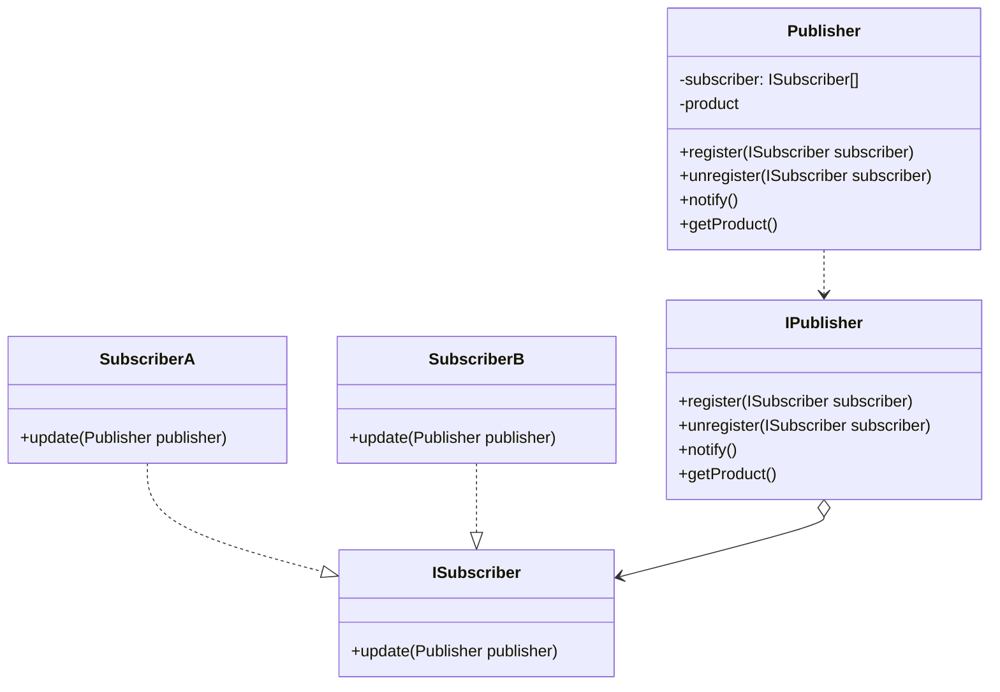

```mermaid
classDiagram
    SubscriberA ..|> ISubscriber
    SubscriberB ..|> ISubscriber
    Publisher ..> IPublisher
    ISubscriber: +update(Publisher publisher)
    IPublisher o--> ISubscriber
    class IPublisher{
        +register(ISubscriber subscriber)
        +unregister(ISubscriber subscriber)
        +notify()
        +getProduct()
    }
    class SubscriberA{
        +update(Publisher publisher)
    }
    class SubscriberB{
        +update(Publisher publisher)
    }
    class Publisher {
        -subscriber: ISubscriber[]
        -product
        +register(ISubscriber subscriber)
        +unregister(ISubscriber subscriber)
        +notify()
        +getProduct()
    }
```
