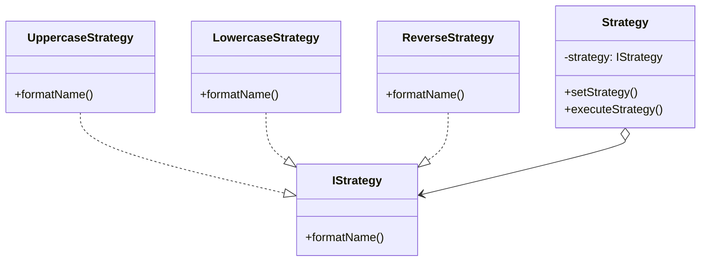

```mermaid
classDiagram
    UppercaseStrategy ..|> IStrategy
    LowercaseStrategy ..|> IStrategy
    ReverseStrategy ..|> IStrategy
    IStrategy: +formatName()
    Strategy o--> IStrategy
    class UppercaseStrategy{
        +formatName()
    }
    class LowercaseStrategy{
        +formatName()
    }
    class ReverseStrategy{
        +formatName()
    }
    class Strategy {
        -strategy: IStrategy
        +setStrategy()
        +executeStrategy()
    }
```
