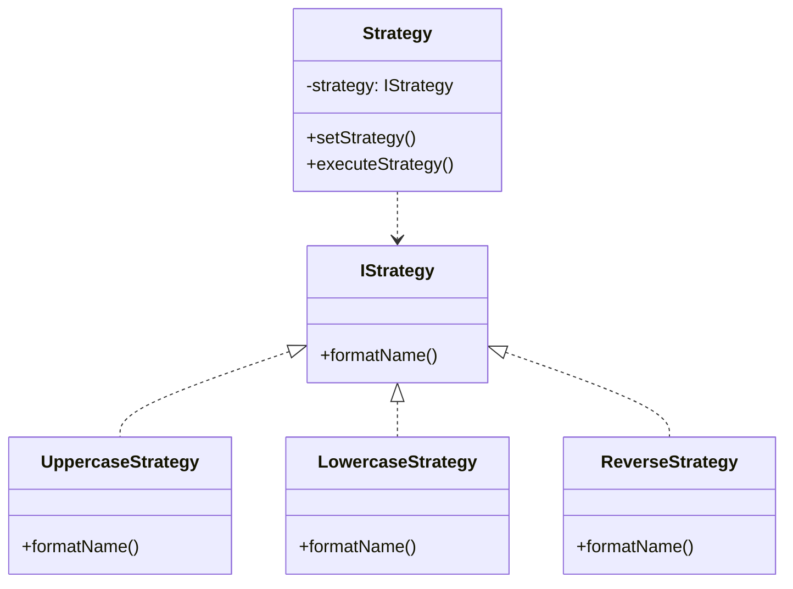

```mermaid
classDiagram
    IStrategy <|.. UppercaseStrategy
    IStrategy <|.. LowercaseStrategy
    IStrategy <|.. ReverseStrategy
    IStrategy: +formatName()
    Strategy ..> IStrategy
    class UppercaseStrategy{
        +formatName()
    }
    class LowercaseStrategy{
        +formatName()
    }
    class ReverseStrategy{
        +formatName()
    }
    class Strategy {
        -strategy: IStrategy
        +setStrategy()
        +executeStrategy()
    }
```
